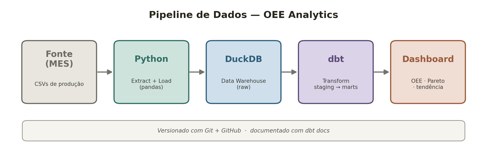
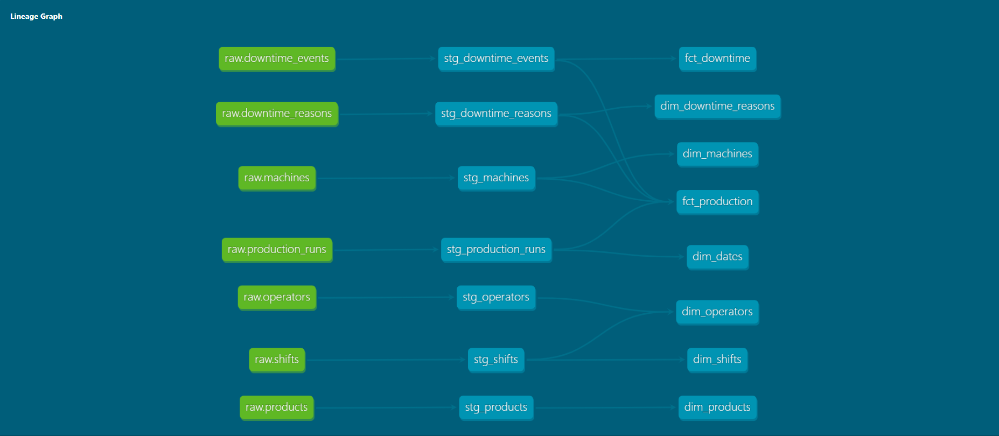
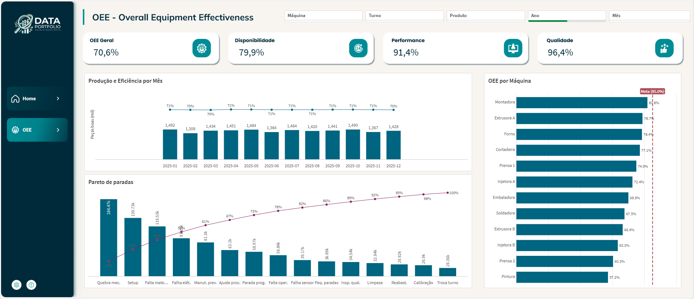

# OEE Analytics — Pipeline de Dados Industriais


Pipeline de dados *end-to-end* que transforma dados de produção de uma fábrica em métricas de **OEE (Overall Equipment Effectiveness)**, usando um stack moderno de Analytics Engineering: **Python + DuckDB + dbt + Qlik Sense**.

> Projeto de portfólio com foco em modelagem dimensional, qualidade de dados e métricas de manufatura (Lean / Six Sigma).

## Sobre o projeto

O OEE é o principal indicador de eficiência da indústria, definido como:

**OEE = Disponibilidade × Performance × Qualidade**

Este projeto simula a exportação de um sistema MES (*Manufacturing Execution System*) e, a partir dos dados brutos, constrói um modelo analítico completo capaz de responder perguntas como:

- Qual o OEE de cada máquina e da fábrica como um todo?
- Quais são as principais causas de parada (análise de Pareto)?
- Como a eficiência varia entre máquinas, turnos e ao longo do tempo?

O dataset simula **18 meses** de operação de uma fábrica com **12 máquinas** em 3 linhas de produção, totalizando ~**15,8 mil** corridas de produção e ~**84 mil** eventos de parada.

## Arquitetura



| Camada          | Ferramenta       | Responsabilidade                          |
|-----------------|------------------|-------------------------------------------|
| Ingestão        | Python (pandas)  | Gera e carrega os dados brutos            |
| Data Warehouse  | DuckDB           | Armazena as camadas raw, staging e marts  |
| Transformação   | dbt              | Modelagem dimensional, testes e docs      |
| Visualização    | Qlik Sense       | Dashboard interativo de OEE               |

## Modelo de dados (star schema)

**Fatos**
- `fct_production` — grão: uma corrida de produção. Contém os três componentes do OEE.
- `fct_downtime` — grão: um evento de parada.

**Dimensões**
- `dim_machines`, `dim_products`, `dim_operators`, `dim_shifts`, `dim_dates`, `dim_downtime_reasons`

A qualidade do modelo é garantida por **24 testes** automatizados do dbt (chaves únicas, integridade referencial entre fatos e dimensões e validação de domínios).

## Linhagem dos dados (dbt)

O grafo de dependências (lineage) gerado automaticamente pelo dbt mostra o fluxo completo, das fontes `raw` até os marts:



## Dashboard (Qlik Sense)

A camada de visualização foi construída no Qlik Sense, consumindo os marts exportados do dbt/DuckDB.



O painel cobre:
- **KPIs** de OEE e seus três componentes (Disponibilidade, Performance, Qualidade)
- **OEE por máquina**, com linha de meta *world class* (85%)
- **Pareto de paradas**, destacando as causas que concentram a maior parte do tempo perdido
- **Produção e eficiência ao longo do tempo** (volume produzido vs OEE mensal)
- **Filtros** interativos por máquina, turno, produto e período

## Principais resultados

- **OEE geral da fábrica: 70,7%** — dentro da faixa típica da indústria ("world class" = 85%).
- **Gargalos identificados:** a *Pintura* (**57,3%**) e a *Prensa 2* (**60,3%**) operam bem abaixo da média, com desempenho fraco nos três componentes — prioridades claras de melhoria contínua.
- **Maiores causas de parada (Pareto):** quebra mecânica, setup / troca de molde e falta de material concentram a maior parte do tempo perdido.

## Como executar

Pré-requisitos: Python 3.11+

```bash
pip install -r requirements.txt
python ingestion/generate_data.py     # gera os CSVs brutos
python ingestion/load_to_duckdb.py    # carrega no DuckDB (camada raw)
cd dbt_oee
dbt build                             # staging + marts + 24 testes
dbt docs generate && dbt docs serve   # documentação e lineage
cd ..
python ingestion/export_for_bi.py     # exporta os marts em CSV para o BI
```

### Configuração do perfil do dbt

O dbt se conecta ao warehouse via `~/.dbt/profiles.yml` (fora do repositório, por convenção de segurança):

```yaml
oee:
  target: dev
  outputs:
    dev:
      type: duckdb
      path: /caminho/absoluto/para/warehouse/oee.duckdb
      threads: 4
```

## Estrutura do projeto

```
.
├── ingestion/          # scripts de geração, carga e export (Python)
├── data/raw/           # dados brutos em CSV (gerado, fora do Git)
├── warehouse/          # data warehouse DuckDB (gerado, fora do Git)
├── dbt_oee/            # projeto dbt (staging + marts)
├── qlik/               # script de carga do Qlik Sense
└── docs/               # documentação e imagens
```

## Tecnologias

Python · pandas · DuckDB · dbt · SQL · Qlik Sense · Modelagem dimensional · Git

---

**Autor:** Thiago Vinicius